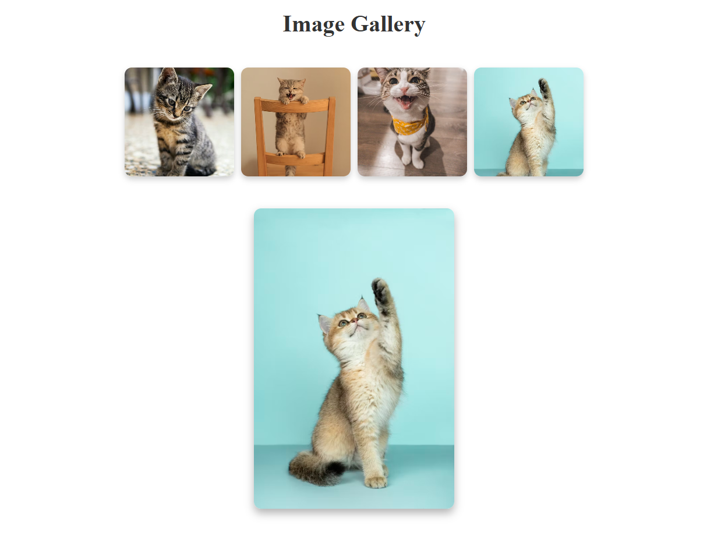

# 📷 Image Gallery  

### **Image Popup**  
  

A simple and interactive **Image Gallery** built using **React.js**. Users can view a collection of images and click on any image to enlarge it.  

## 🌐 Hosted Link  
🔗 **Live Demo:** [Click here to view](https://react-image-gallery-theta-one.vercel.app/)  

## 🚀 Features  
- 🖼️ Display multiple images in a grid layout  
- 🔍 Click to view an enlarged image  
- 🎨 Stylish hover effects  
- 📱 Fully responsive design  

## 🛠️ Tech Stack  
- **React.js** – Frontend framework  
- **CSS Modules** – Styling for a component-based approach  

